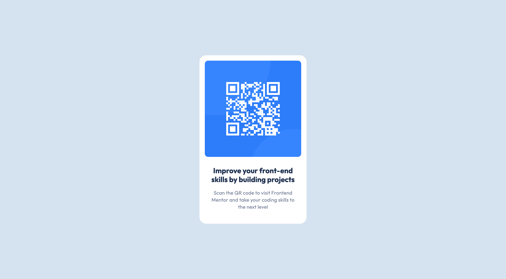

# Frontend Mentor - QR Code Component Solution

This is my solution to the [QR code component challenge on Frontend Mentor](https://www.frontendmentor.io/challenges/qr-code-component-iux_sIO_H). It's a beginner-friendly project that helped me practice working with Figma files, writing clean HTML & CSS, and following a professional frontend development workflow.

## Table of Contents

- [Overview](#overview)
  - [Screenshot](#screenshot)
  - [Links](#links)
- [My Process](#my-process)
  - [Built With](#built-with)
  - [What I Learned](#what-i-learned)
  - [Continued Development](#continued-development)
  - [Useful Resources](#useful-resources)
- [Author](#author)

---

## Overview

### Screenshot



### Links

- [Live Site URL](https://your-live-site-url.com)
- [Solution on Frontend Mentor](https://your-solution-url.com)

---

## My Process

### Built With

- Semantic HTML5
- CSS custom properties
- Flexbox
- Mobile-first workflow
- Figma design reference
- Manual pixel-perfect matching
- VS Code

### What I Learned

This project taught me how to:

- Analyze Figma designs for implementation
- Set up a style guide from the design
- Match font sizing, spacing, line height, and letter spacing precisely
- Use a professional development workflow with validation and cleanup
- Structure clean, semantic HTML with accessibility in mind

#### Example: Matching text spacing

```css
.title {
  font-size: 22px;
  font-weight: 700;
  line-height: 120%;
  letter-spacing: 0;
}
.text {
  font-size: 15px;
  line-height: 140%;
  letter-spacing: 0.2px;
}
```

### Continued Development

In future projects, I want to:

Explore component-based styling with frameworks like Tailwind CSS or Styled Components

Automate my workflow using tools like Prettier and ESLint

Get more confident using Git and GitHub for version control

### Useful Resources

Frontend Mentor - Help Center – For tips on how to tackle challenges

The Markdown Guide – For writing a clean README

CSS Tricks – For CSS-related issues

## Author

GitHub – [@Raghavendra-Yadav](https://github.com/Raghavendra-Yadav)

Frontend Mentor – [@Raghavendra-Yadav](https://www.frontendmentor.io/profile/Raghavendra-Yadav)
